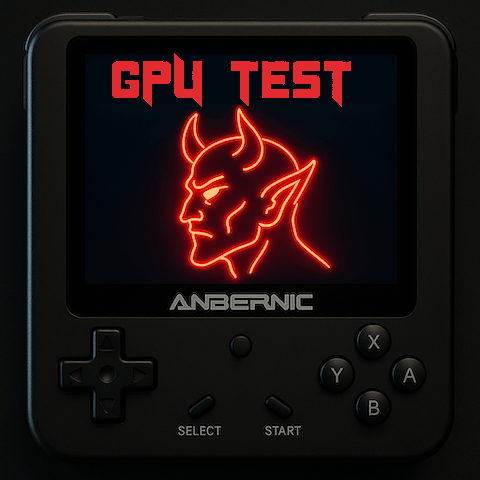

# README.md

# Cyber GPU Stress Test

**Cyber GPU Stress Test** is a compact visual stress testing utility designed for devices like **Anbernic RG35XX Plus** running **Knulli Custom Firmware**.

This tool renders hundreds of animated boxes bouncing on the screen to measure rendering performance and observe FPS behavior under heavy graphical load.



---

## 🚀 Features

- Realtime FPS display as a visual bar
- 600+ randomized objects with color and motion
- Fullscreen rendering for performance testing
- Auto-exits after 60 seconds of inactivity

---

## 🛠 Requirements

- Rust 1.76 or newer
- SDL2 and SDL2_ttf libraries
- Font path (customizable):
  `/usr/share/fonts/dejavu/DejaVuSans-Bold.ttf`

---

## 🧪 Run Locally

```bash
cargo run --release
```

To cross-compile for Anbernic (aarch64):

```bash
make build
make deploy
```

---

## 🐳 Run via Docker (for Anbernic cross-build)

```bash
make docker
```

Then deploy:

```bash
make deploy
```

---

## 📂 Project Structure

- `src/main.rs` — main stress test implementation
- `roms/tools/` — launcher script on device
- `userdata/bin/` — where binaries are placed
- `images/` — optional assets (logo, screenshots)

---

## 🎮 Verified On

- Anbernic RG35XX Plus
    - Knulli CFW v0.3+
    - SDL2 framebuffer (no X11)

